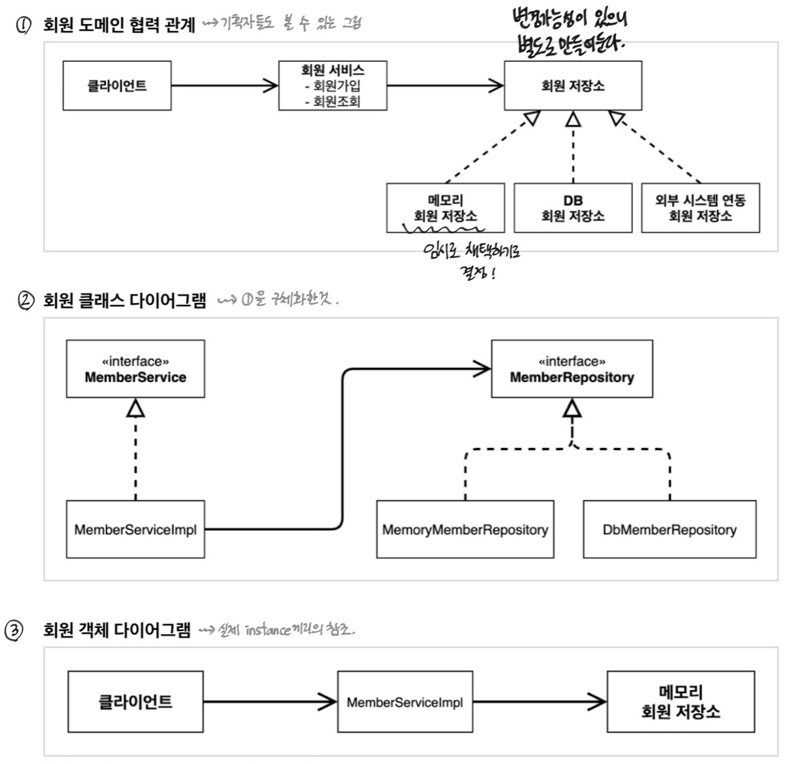
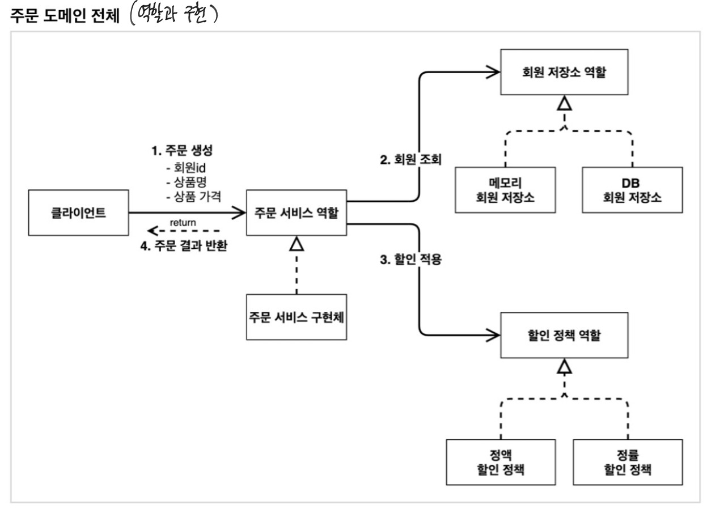
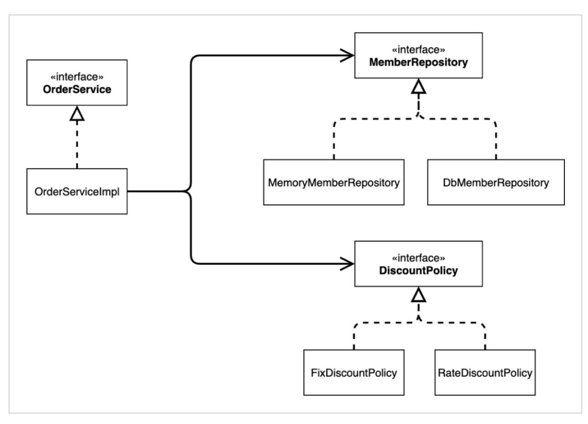
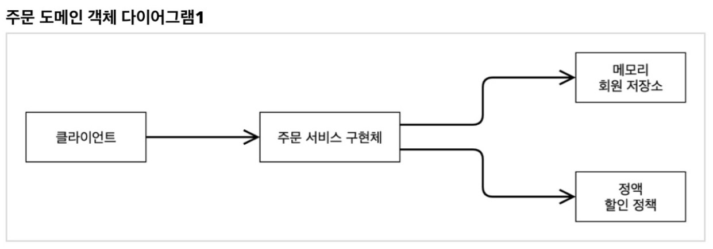
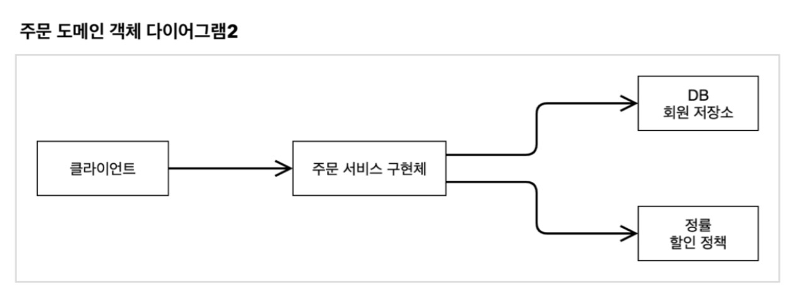

## 학습 목표
- Spring 핵심 원리 이해 ⭐️
- Spring 도움 없이, 순수한 자바로만 개발을 진행한다.

- 결국 Spring framework를 만들게 된다!!
   

✅ 환경설정 편의를 위해 스프링부트 스타터에서 프로젝트를 생성할거지만,
**이때 어떠한 dependencies도 선택하지 않는다**

 

# 비즈니스 요구사항과 설계
### 회원
- 회원 가입, 회원 조회 기능이 있다.
- 회원 등급: 일반, VIP 총 2가지
- 회원 데이터: 미정 (자체 DB 구축할수도 있고, 외부 시스템과 연동할 수도 있다.)
### 주문, 할인 정책
- 회원은 상품을 주문할 수 있다.
- 모든 VIP에게는 고정 금액 1000원을 할인해준다.
- 할인 정책은 변경 가능성이 매우 높다.
- 회사는 기본 할인 정책을 아직 결정하지 못했고, 최악의 경우 할인을 적용하지 않을 수도 있다.

## 1️⃣ 회원 도메인 설계

## 2️⃣ 주문과 할인 도메인 설계
역할과 구현을 분리함으로써, 회원 저장소와 할인 정소를 유연하게 변경할 수 있다.

#### ✔️ 클래스 다이어그램

#### ✔️ 객체 다이어그램 예시 1, 2
회원 저장소와 할인정책을 바꾸더라도, 주문 서비스를 변경하지 않아도 된다.

