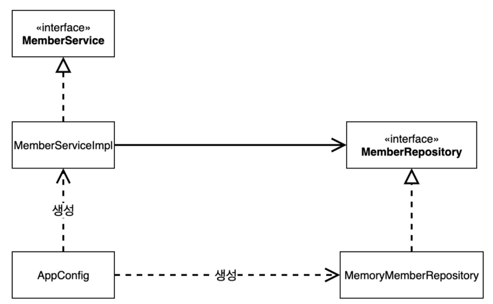

## 할인정책 변경 !
#### 할인정책이 고정 할인 정책에서 정률 할인 정책으로 변경되었다.
1️⃣ DiscountPolicy를 implement하는 RateDiscountPolicy 클래스를 새로 만들어주고 기능을 구현한다.<br>
2️⃣ OrderServiceImpl 코드를 변경한다.
```
public class OrderServiceImpl implements OrderService{

//    private final DiscountPolicy discountPolicy = new FixDiscountPolicy();
    private final DiscountPolicy discountPolicy = new RateDiscountPolicy();
    
}
```
<br>


## OCP와 DIP 위반의 문제 발생 !!!<br>
#### ⛔️  OCP 위반: 기능을 변경하려면 클라이언트 코드인 `OrderServiceImpl` 코드를 수정해야한다!!!<br>
#### ⛔️  DIP 위반: `OrderServiceImpl`은 `DiscountPolicy`인터페이스에 의존하지만, 구체화 클래스인 `FixDiscountPolicy`에도 의존하고 있다!!!<br>

<br>

## 💡 해결

`OrderServiceImpl`은 `DiscountPolicy` 즉 인터페이스에**만** 의존하도록 설계와 코드를 변경한다.
```
public class OrderServiceImpl implements OrderService{

    private DiscountPolicy discountPolicy;
    
    }
```

새로운 문제점 - 인터페이스만 있고 구현체가 없다! --> null pointer exception 발생

해결방안 - 누군가 클라이언트인 `OrderServiceImpl`에 `DiscountPolicy`의 구현 객체를 대신 생성하고 주입해주어야 한다.<br>
<br>

## AppConfig 등장
 - 애플리케이션의 실제 동작에 필요한 **구현 객체를 생성하고 연결**하는 책임을 갖는다.<br>
 - 생성한 객체 인스턴스의 레퍼런스를 생성자를 통해서 연결해준다. (**생성자 주입**)<br>
 - 애플리케이션의 전체 동작 방식을 config하는 별도의 설정 클래스이다.<br>
 - ‘공연 기획자’ 역할<br>

<br>

### 💡 DIP 완성
✅ `MemberServiceImpl`은  `MemoryMemberRepository`에는 의존하지 않고, `MemberRepository`에만 의존하게 되었다.<br>

✅ `OrderServiceImpl`은 `FixDiscountPolicy`에는 의존하지 않고, `DiscountPolicy`인터페이스에만 의존하게 되었다.<br>

✅ 즉, `MemberServiceImpl`과 `OrderServiceImpl`은 의존관계에 대한 고민은 외부에 맡기고, **실행에만 집중**하게 되었다!! <br>

<br>

## 재설계된 회원 서비스 클래스 다이어그램 (DIP 만족)


**관심사의 분리**
- 객체를 생성하고 연결하는 역할(`AppConfig`)과 실행하는 역할(`MemberServiceImpl`)이 명확하게 분리되었다.

**의존관계 주입 (Dependency Injection)**
- 클라이언트인 `MemberServiceImpl` , `OrderServiceImpl`입장에서 보면 의존관계를 외부에서 주입해주는 것이 되므로 의존관계 주입이라고 한다.
- 어떤 객체가 들어올지는 오직 외부(`AppConfig`)에서 결정한다.
